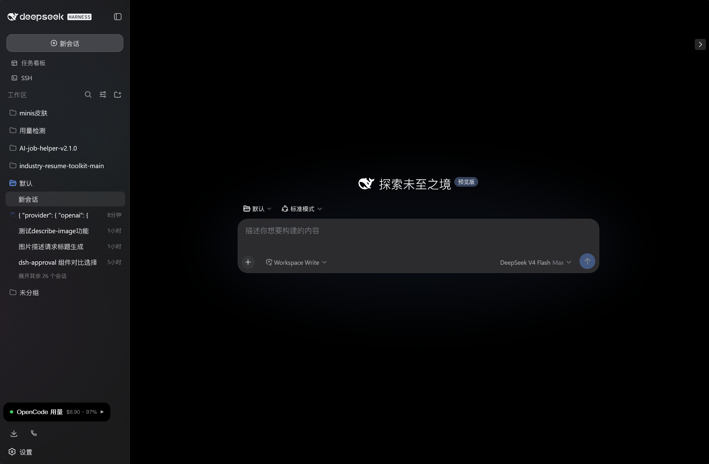
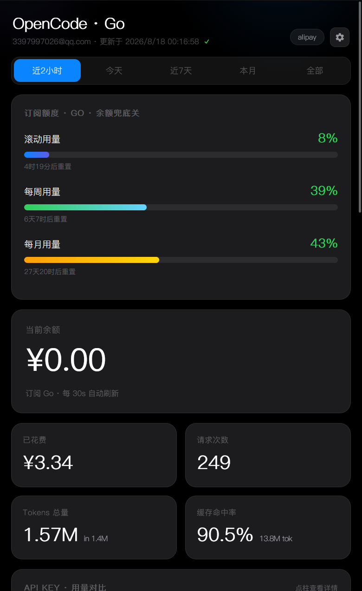
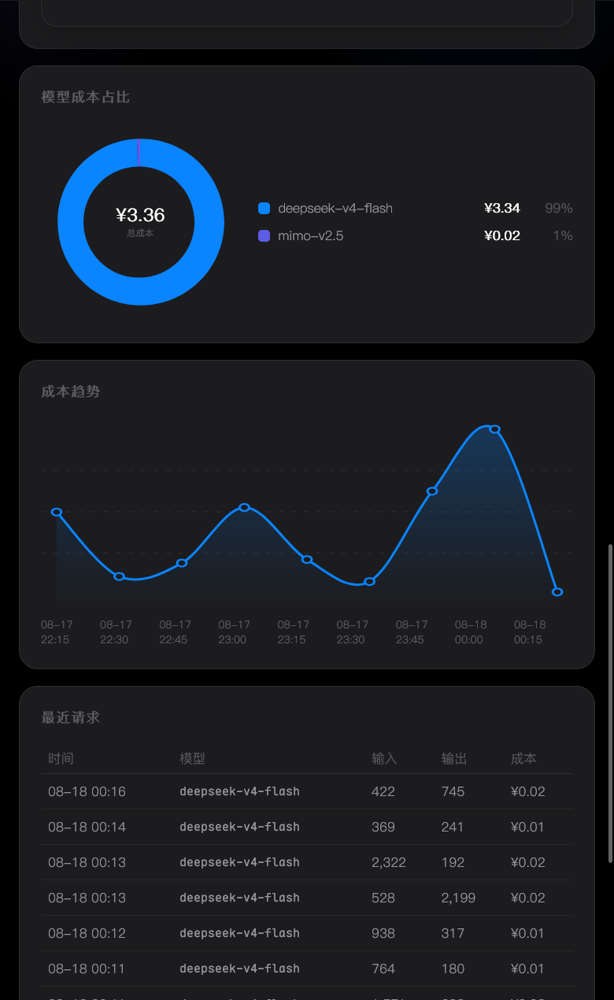

# dsh-usage-panel

在 **DeepSeek Harness (DSH) Web** 右下角常驻一张可拖动的用量悬浮卡片，点击即展开完整仪表盘：余额、花费、订阅额度、API Key 用量对比、模型成本占比、成本趋势、请求明细。

取数逻辑**直接运行在 DSH 宿主进程内**，挂在 DSH web 的同源路由 `/dsh-usage-panel/*` 上——**没有独立数据服务、没有常驻终端窗口、无需开机自启**，DSH 在跑就有数据，重启电脑也无需任何额外操作。

---

<table>
 <tr>
 <td align="center"><br><sub>完整仪表盘</sub></td>
 <td align="center"><br><sub>用量详情</sub></td>
 </tr>
</table>

| 功能 | 说明 |
| --- | --- |
| 🃏 悬浮卡片 | 可拖动、记住位置、单击展开完整仪表盘 |
| 📊 完整仪表盘 | 日期筛选、余额、指标卡、订阅额度 |
| 🍩 圆环图 | 模型成本占比 + 中心总成本 |
| 📈 成本趋势 | 粒度自适应（15 分钟 / 小时 / 天） |
| 🔑 Key 对比 | 柱状图概览 API Key 用量，点柱看成本 / 请求 / 命中率 |
| 📋 明细表 | 逐条请求记录（时间 / 模型 / 成本 / Token） |
| 🎨 主题跟随 | 自动同步 DSH web 亮 / 暗模式（含展开瞬间即时推送） |
| ⚙️ 设置 | 刷新间隔（10/30/60 秒或关闭）、汇率自动更新、¥ 换算 |

---

## 🚀 安装（Windows 一键）

> 前置：已安装 **Node.js ≥ 18** 与 **DeepSeek Harness**（`npm install -g @deepseek-ai/dsh`），并有 opencode.ai 账号。

1. 双击 **`install.bat`**
 - 自动检查 node / npm / dsh（pnpm 缺失会自动安装）
 - `npm pack` 用**当前最新产物**打包，装入 DSH web profile 并校验安装结果
2. 双击 **`set-credentials.bat`**（只需一次）
 - 按提示录入 opencode 的 auth cookie 与 workspace id，保存到 `%DSH_HOME%\usage-panel.json`
3. **重启 DSH web**（或按提示热重载），刷新页面 —— 右下角出现用量卡片

之后**无需任何操作**。改凭据：再双击一次 `set-credentials.bat`；卸载：双击 `uninstall.bat`（凭据文件保留，重装可复用）。

### 手动安装（其他平台 / 进阶）

```bash
npm pack --pack-destination "<ASCII路径>"
dsh plugin --profile web add "<ASCII路径>/dsh-usage-panel-0.1.1.tgz"
```

凭据二选一（优先级：环境变量 > JSON 文件）：

```bash
# 方式一：环境变量（临时）
OPCODE_AUTH="<auth cookie>" OPCODE_WORKSPACE_ID="wrk_..." node ...

# 方式二：JSON 文件（推荐，含 DSH_HOME 回退）
# %DSH_HOME%\usage-panel.json  或  ~/.dsh/usage-panel.json
# {"auth":"...","workspaceId":"wrk_..."}
```

写好后**重启 DSH web** 并刷新页面。

---

## ⚙️ 数据流与架构

```text
┌──────────────── DSH Web（浏览器）───────────────┐
│  悬浮卡片 client.js ──fetch──▶ /dsh-usage-panel/data
│     iframe(同源)  dashboard.html ─fetch─▶ /dsh-usage-panel/data
└──────────────────────┬──────────────────────────┘
                       │ 同源(宿主进程注入的路由)
┌──────────────────────▼──────── DSH 宿主进程 ──────┐
│  lib/index.js：读凭据 → 抓取 opencode.ai _server  │
│  → seroval 安全解析 → 汇总缓存(30s TTL + 互斥刷新) │
└───────────────────────────────────────────────────┘
```

- 宿主路由经 `inject: ['webServer']` 声明，由 `ctx.webServer.register({kind:'prefix', path:'/dsh-usage-panel', handler})` 挂载
- 无独立端口、无跨域问题、无需要常驻的进程

---

## ⚙️ 仪表盘设置

| 设置 | 默认 | 说明 |
| --- | --- | --- |
| 自动刷新 | 30 秒 | 10 / 30 / 60 秒或关闭 |
| 汇率 | 每日自动 | 自动抓取 USD→CNY，按天缓存 |
| 显示 ¥ 换算 | 开 | 美元主价 + 人民币副价 |
| 只显示人民币 | 关 | 所有金额仅显示 ¥ |

---

## 🔒 安全

- **无 eval**：opencode 的 seroval 响应由受限解释器解析（白名单语法、20MB 上限），远程代码无法执行
- **路由仅回环**：非 127.0.0.1 / ::1 的请求一律 `403 loopback-only`，局域网内其他设备无法访问数据
- **同源**：卡片与仪表盘走 DSH web 同源路由，无跨域数据泄露面
- **响应头加固**：`x-content-type-options: nosniff`、禁缓存
- **凭据本机私有**：只存 `%DSH_HOME%\usage-panel.json`（请勿提交或外传）

---

## ❓ 常见问题

| 现象 | 原因 / 处理 |
| --- | --- |
| 卡片显示「未配置凭据」 | 还没运行 `set-credentials.bat`，或 cookie 已失效 → 重新录入 |
| 卡片显示「未连接」 | 多为 cookie 失效或接口暂不可达 → 重新录入后等待约 30 秒自动重试 |
| 数据空白 | cookie 失效或 workspace id 不对 → 重新录入后刷新页面 |
| 趋势图只有近 2 天 | opencode 服务端仅保留约 2 天明细，属正常 |
| 主题不一致 | 刷新页面即可；仪表盘会自动跟随 DSH web 亮暗 |
| 卸载后卡片还在 | 重启 / 刷新 DSH web；确认 `uninstall.bat` 已执行 `dsh plugin remove` |

---

## 🛠️ 开发

```bash
npm pack        # 打 tarball（版本见 package.json）
node --check lib/index.js && node --check lib/client.js   # 语法自检
```

```text
dsh-usage-panel/
├── lib/index.js          # 宿主端：凭据/抓取/seroval 解析/汇总 + /dsh-usage-panel/* 路由
├── lib/client.js         # 浏览器端：悬浮卡片 + iframe（同源）
├── dashboard.html        # 完整仪表盘（同源取数、主题跟随）
├── install.bat           # Windows 一键安装
├── set-credentials.bat   # 录入凭据（%DSH_HOME%\usage-panel.json）
├── uninstall.bat         # Windows 一键卸载
├── cordis.patch.yml      # DSH bundle 挂载声明
└── package.json          # type: module；bundle + client(web) 声明
```

---

## 📄 License

MIT

> 免责声明：本项目逆向 opencode.ai 前端接口获取数据，仅供个人学习使用，请遵守 opencode.ai 服务条款。
